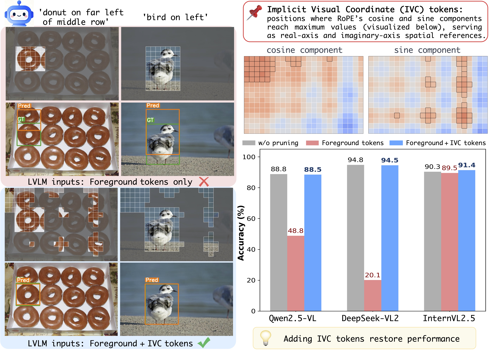
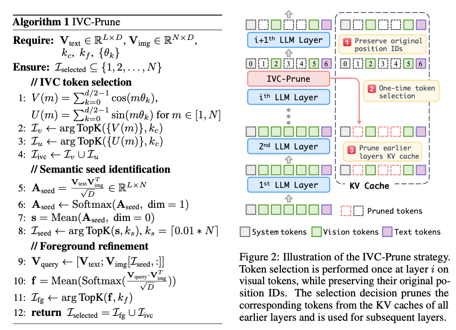

<p align="center">
  <h1 align="center"> IVC-Prune: Revealing the Implicit Visual Coordinates in LVLMs for Vision Token Pruning
</h1>
  <p align="center">
<a href="https://sunzc-sunny.github.io/">Zhichao Sun</a>, Yidong Ma, Gang Liu, Yibo Chen, Xu Tang, Yao Hu, Yongchao Xu
<h4 align="center"> Xiaohongshu Inc. &emsp;&emsp;&emsp; Wuhan university
  </p>
  <h3 align="center"><a href="https://arxiv.org/abs/2602.03060">Paper</a>
  <!-- <div align="center"></div> -->
</p>

## ICLR 2026

[](LICENSE)

## Overview
💡 We reveal a fundamental mechanism of how LVLMs process spatial information：
<p style="font-size: 16px;"><b>LVLMs implicitly establish visual coordinate systems through Rotary Position Embeddings (RoPE).</b></p>
Through theoretical analysis, we discover that specific token positions serve as Implicit Visual Coordinates (IVC tokens)—spatial reference points essential for absolute object localization. These positions occur where RoPE's rotation matrices approximate:

- Identity matrix (real-axis references)

- 90° rotation matrix (imaginary-axis references)

This provides the first theoretical characterization of spatial reasoning mechanisms in LVLMs.



### 🚀 Method: IVC-Prune

A training-free, prompt-aware pruning strategy that preserves two crucial token types:
1. IVC Tokens: Identified by analyzing RoPE's mathematical properties (cosine/sine components across dimensions)
2. Foreground Tokens: Selected via a robust two-stage process:
    - Stage 1: Semantic seed identification using value-vector similarity (avoiding positional bias)
    - Stage 2: Contextual refinement to capture complete objects

Key Innovation: Single-selection pruning strategy—tokens are selected once at an intermediate layer and applied across all layers, maximizing KV-cache reduction while preserving original position IDs.




## 📝 TODO List: 

Open Source Plan for Qwen, LLaVA, InternVL, DeepSeek Support

**Supported LVLMs**

  -  ✅ **Qwen-VL Support**  ([transformers code](transformers/src/transformers/models/qwen2_5_vl/modeling_qwen2_5_vl.py))
      -  Qwen2.5-VL
      -  Qwen2-VL

  - [ ] **LLaVA Support**

  - [ ] **InternVL Support**

  - [ ] **DeepSeek-VL Support**


## Table of Contents

- [Installation](#installation)
- [Dataset](#dataset)
- [Usage](#usage)
- [Citation](#Citation)

## Installation
Based on VLMEvalKit and transformers. We have supported grounding data testing code in VLMEvalKit.


Please follow the guide to install and set up of the VLMEvalKit. 
```
conda create --name IVCP python=3.10.6 -y
conda activate IVCP

cd VLMEvalKit
pip install -e .

pip uninstall numba -y
pip install numba
pip install qwen_vl_utils

pip install torch==2.3.0 torchvision==0.18.0 torchaudio==2.3.0 --index-url https://download.pytorch.org/whl/cu118
pip install flash-attn==2.5.8 --no-build-isolation -v

```

## Dataset
We provide the RefCOCO grounding dataset on [Hugging Face](https://huggingface.co/datasets/sunzc-sunny/IVCP).

After downloading the dataset, please modify the `DATASET_URL` in `IVCP/VLMEvalKit/vlmeval/dataset/image_grounding.py`:

```python
DATASET_URL = {
    'RefCOCO_testA': '/PATH/refcoco_testA.tsv',
    'RefCOCO_testB': '/PATH/refcoco_testB.tsv', 
    'RefCOCO_val': '/PATH/refcoco_val.tsv', 
    .....
    'RefCOCOg_test': '/PATH/refcocog_test.tsv',
    'RefCOCOg_val': '/PATH/refcocog_val.tsv',
}
```


## Usage

To evaluate the model on grounding tasks, run the following script:

```bash
cd IVCP/VLMEvalKit
bash test_ivcp_qwen_grounding.sh
```

To evaluate general VQA tasks, run:

```bash
bash test_ivcp_qwen_generalvqa.sh
```

**Note:**  
Before running the scripts, please make sure to **modify the dataset paths** in `test_ivcp_qwen_grounding.sh` (specifically lines 2-3) to point to your actual dataset location, e.g.:  `export LMUData="/your/dataset/path"`

Some VQA Benchmark tests require the use of an API. Please configure your API according to the VLMEvalKit instructions. By default, we use GPT-4o.


## Citation

```bibtex
@misc{sun2026ivcprunerevealingimplicitvisual,
      title={IVC-Prune: Revealing the Implicit Visual Coordinates in LVLMs for Vision Token Pruning}, 
      author={Zhichao Sun and Yidong Ma and Gang Liu and Yibo Chen and Xu Tang and Yao Hu and Yongchao Xu},
      year={2026},
      eprint={2602.03060},
      archivePrefix={arXiv},
}
```


